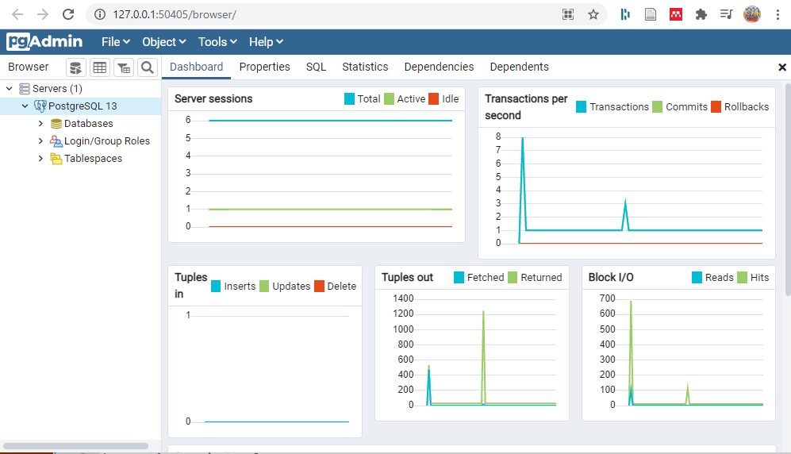

# Web Apps

In this session we will explore some of the concepts behing the development of web applications. We will use a Django web app as use case, but this won't be a Django tutorial.

Make sure you complete the **Get Ready** section before the session.

## Objectives
- Understand the View-Model-Controler paradigm in the development of web applications.
- Understad how a DBMS (database mangement system) interacts with a web application.
- Implement a basic Django app for photo feeds.

## Get Ready

Before the session copy the repository, and install what is mentioned below.

### 1. DJango Photo Feed App

This a Django app to  building a photo feed, and it was originally developed by [Samuel Ogundipe](https://github.com/samuelayo). The app is similar to instagram, but a stripped off version without the comments and like feature. The original tutorial can be found here: [https://pusher.com/tutorials/photo-feed-django/ ](https://pusher.com/tutorials/photo-feed-django/) 

**Build with:**
* [Pusher](https://pusher.com/) - APIs to enable devs building realtime features
* [DJango](https://docs.djangoproject.com/) - The web framework for perfectionists with deadlines. 
* [Jquery](https://jquery.com/) - The Write Less, Do More, JavaScript Library

#### Clonning the App

These instructions (for Windows) will get you a copy of the project up and running on your local machine for development and testing purposes. 

- Clone this repository by running: 
```shell
> git clone https://github.com/manuGil/photo_feed.git
```
- Change directory to the cloned repo
```shell
> cd photo_feed
```
- Create a Python virtual environment
```shell
> python -m venv C:\devel\photo_feed\venv
```
- Activate viertual environment and install required libraries: i.e pusher and django
```shell
# Activate virtualevironment
> venv\Scripts\activate 
(venv) > pip install django pusher
```
> If installing packages with pip finishes with errors. Run the last command a second or third time. Ignore the 'warning' about updating pip.

#### Setup Pusher (Not used in this Codig Session)

~~Replace the XXX_APP_ID, XXX_APP_KEY, XXX_APP_SECRET and XXX_APP_CLUSTER with your own keys you obtained when you created an app on Pusher in the line below in your `photofeed\views.py` file. If you dont have a Pusher account, sign up [here](Https://pusher.com)~~

```
Pusher(app_id=u'XXX_APP_ID', key=u'XXX_APP_KEY', secret=u'XXX_APP_SECRET', cluster=u'XXX_APP_CLUSTER')
```
~~Replace the XXX_APP_KEY and XXX_APP_CLUSTER with your app key and cluster respectively in the `feed\templates\index.html` file.~~

#### Database Migrations
 - Run the following command at the root of your application to  make the migrations needed for the database. The root directory is where the file `manage.py` is
 
 ```shell
 python manage.py makemigrations
 ```
 
 - Run this command to migrate the database
 
 ```shell
  python manage.py migrate
 ```

And finally, start the application to check that it works.

```
python manage.py runserver.
```
and visit http://localhost:8000/ to see that the application is working. Move to the next step.

### 2. Install PostgreSQL

By default any Django app uses *sqLite* as a database. This is file-based datase which is very handy for fast development. However, in production a professional Database Management System should be used, e.g., MySQL, PostgreSQL. We will use postgreSQL.

- [Download the latest version of postgreSQL](https://www.enterprisedb.com/downloads/postgres-postgresql-downloads) for you OS and install it. Put special attention to:
1. the **password** you will set for the superuser *postgres*
2. the **port** you will assign during the installation. Use the default port, but make sure the port is not been used already
3. the **locale**, use the default
4. Skip the part prompting to start the Stack Builder

For detials on installing PosgreQSL check the [documentation](https://www.postgresql.org/download/) for your OS.

- Check that the installation was successful by starting **PGAdmin 4** (a GUI to administrate PostreSQL). The app will open in the browser.
1. Enter that password you set during installation.
2. Click over **Servers** on the left panel. Enter the password again.
3. If the installation was successful, you should see the server dashboard



